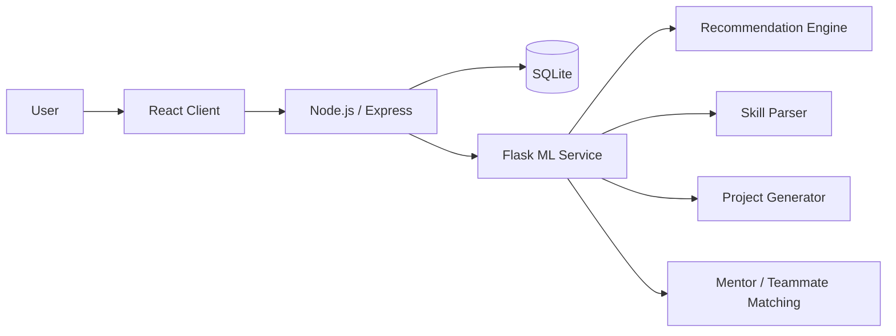
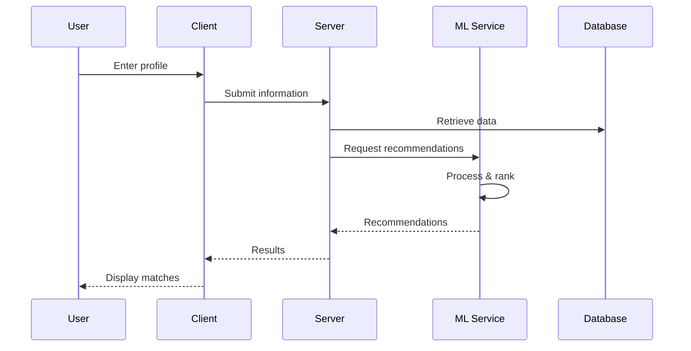
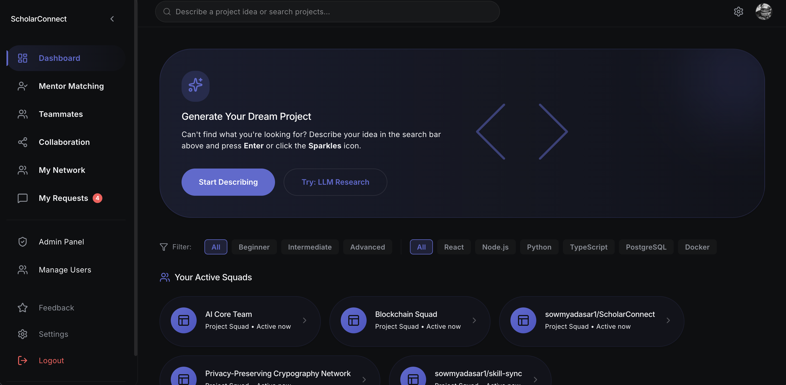
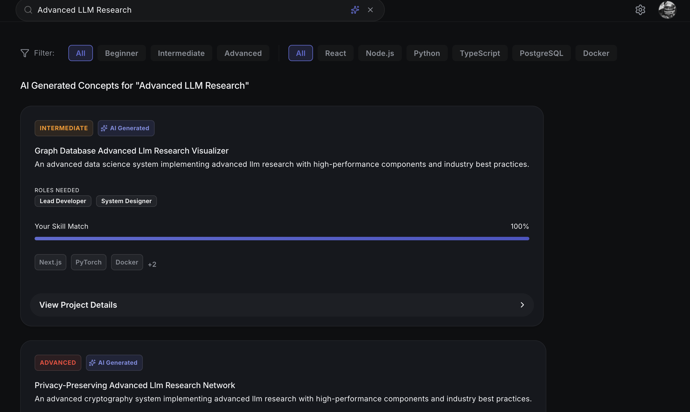
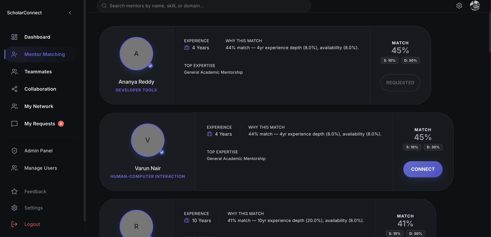
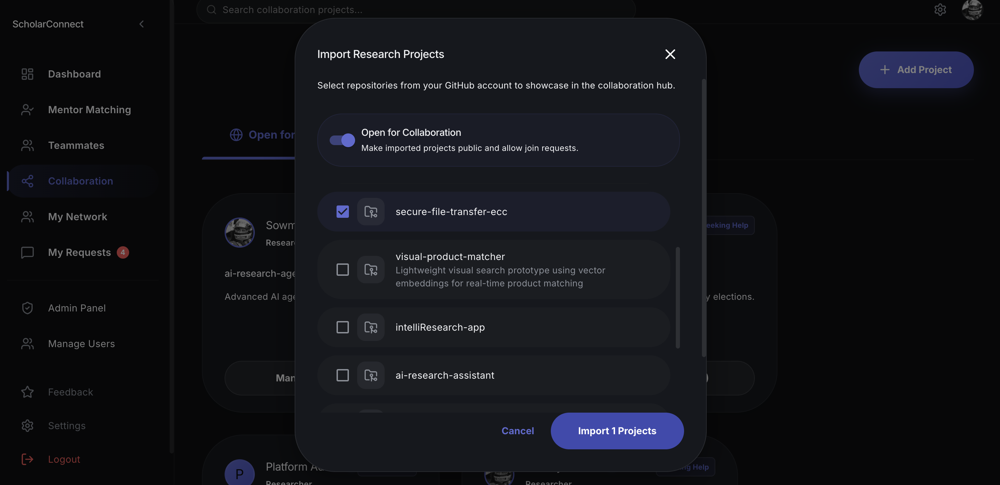

# ScholarConnect

### Research Collaboration & Project Recommendation Platform

[](https://react.dev/)
[](https://nodejs.org/)
[](https://www.python.org/)
[](https://flask.palletsprojects.com/)
[](https://www.docker.com/)

> A full-stack platform that helps students and researchers discover relevant projects, mentors, and teammates based on their skills, interests, and academic background.

---

## Overview

ScholarConnect combines a web application with a dedicated machine-learning service to turn user profiles into project and collaboration recommendations.

The platform brings together:

* Project recommendations
* Mentor matching
* Teammate matching
* Skill extraction
* Project idea generation
* Skill-gap and learning suggestions

The application is split into a React client, Node.js/Express backend, Python/Flask ML service, and SQLite database.

---

## Why this project?

Finding a research project or collaborator is often less about having no options and more about finding the **right** option.

ScholarConnect explores how a user's:

```text
Skills + Proficiency + Interests + Role + Academic Level
                           ↓
                  Recommendation Engine
                           ↓
              Projects / Mentors / Teammates
```

---

## System Architecture



The ML service is kept separate from the main application so recommendation logic can evolve independently from the web application.

---

## Recommendation Engine

ScholarConnect uses a hybrid scoring approach combining explicit profile matching with text similarity.

| Signal                          | Weight |
| ------------------------------- | -----: |
| Skill overlap                   |    35% |
| Proficiency / complementary fit |    25% |
| Role fit                        |    20% |
| Interest similarity             |    10% |
| Experience compatibility        |    10% |

### Interest Matching

User interests and project descriptions are represented using:

```text
TF-IDF
   ↓
Vector Representation
   ↓
Cosine Similarity
   ↓
Interest Score
```

The final recommendation score combines the individual signals and ranks the available projects.

Recommendations can also include matched skills, missing skills, explanations, and learning suggestions.

---

## ML Service

The Python/Flask service exposes dedicated endpoints for recommendation and matching:

| Endpoint                 | Purpose                 |
| ------------------------ | ----------------------- |
| `GET /health`            | Service health check    |
| `POST /recommend`        | Project recommendations |
| `POST /generate`         | Project ideas           |
| `POST /match/mentors`    | Mentor matching         |
| `POST /match/teammates`  | Teammate matching       |
| `POST /nlp/parse-skills` | Skill extraction        |

### Skill Extraction

The NLP component processes free-form profile text and identifies skills from a controlled technical vocabulary.

```text
"I work with Python, SQL and Docker."

              ↓

Python
SQL
Docker
```

---

## Application Flow



---

## Project Structure

```text
ScholarConnect/
├── client/          # React frontend
├── server/          # Node.js / Express backend
├── ml-service/      # Flask ML service
│   ├── recommender/
│   ├── matcher/
│   └── nlp/
├── database/        # Database resources
├── architecture/    # Architecture documentation
├── scripts/         # Utility scripts
└── docker-compose.yml
```

---

## Tech Stack

| Layer          | Technologies                |
| -------------- | --------------------------- |
| Frontend       | React, Vite                 |
| Backend        | Node.js, Express            |
| ML             | Python, Flask, Scikit-learn |
| NLP            | TF-IDF, Cosine Similarity   |
| Database       | SQLite                      |
| Authentication | JWT, OAuth                  |
| Security       | Helmet, Rate Limiting       |
| Deployment     | Vercel, Docker              |

---

## Quick Start

### Docker

```bash
git clone https://github.com/sowmyadasar1/ScholarConnect.git
cd ScholarConnect

docker compose up --build
```

Services:

```text
Client      → http://localhost:5173
Server      → http://localhost:5002
ML Service  → http://localhost:5001
```

### Local Development

Run the client, server, and ML service independently using the setup instructions in their respective directories.

---

## Screenshots

### Dashboard



### Project Recommendations



### Mentor Matching



### Collaboration




---

## What I Learned

* Designing a multi-service application
* Building REST APIs with Node.js and Flask
* Implementing hybrid recommendation logic
* Using TF-IDF and cosine similarity
* Processing profile and skill information
* Separating ML logic from application logic
* Containerizing services with Docker Compose

---

## Limitations

* Skill extraction currently uses a controlled vocabulary.
* Recommendation weights are manually defined.
* Recommendation quality has not been evaluated on a large real-world dataset.
* SQLite is used for the current application database.
* Project generation uses predefined project templates rather than a trained generative model.

---

## Future Improvements

* [ ] Learn recommendation weights from user feedback
* [ ] Add embedding-based semantic search
* [ ] Expand skill extraction and normalization
* [ ] Add recommendation evaluation with Precision@K / NDCG
* [ ] Improve teammate and mentor ranking
* [ ] Add production database and monitoring

---

## Links

**Repository:** [github.com/sowmyadasar1/ScholarConnect](https://github.com/sowmyadasar1/ScholarConnect)

**Live Demo:** [ScholarConnect](https://scholar-connect-taupe.vercel.app/)

---

<p align="center">
  Built around <b>recommendation systems, NLP, and full-stack engineering.</b>
</p>
