# ScholarConnect — System Architecture Documentation

<div class="cover">
  <h1>ScholarConnect</h1>
  <div class="subtitle">Complete Architecture & Engineering Design Package</div>
  <div class="meta">Generated: April 2026</div>
</div>

<div class="page">
  <h2>Table of Contents</h2>
  <div class="toc">
    <div class="toc-section">Section A — System Architecture</div>
    <div class="toc-item">1. High-level system architecture</div>
    <div class="toc-item">2. Client-server communication</div>
    <div class="toc-item">3. Component architecture</div>
    <div class="toc-section">Section B — Data Flow Diagrams</div>
    <div class="toc-item">4. DFD Level 0 (Context)</div>
    <div class="toc-item">5. DFD Level 1</div>
    <div class="toc-item">6. DFD Level 2 (Critical Subsystems)</div>
    <div class="toc-section">Section C — Database / Data Model</div>
    <div class="toc-item">7. ER Diagram (Logical)</div>
    <div class="toc-item">8. Database Schema / Collections</div>
    <div class="toc-item">9. Schema Design Document</div>
    <div class="toc-section">Section D — Algorithm & Workflows</div>
    <div class="toc-item">10. Skill Selection Flow</div>
    <div class="toc-item">11. Project Recommendation Flow</div>
    <div class="toc-item">12. Mentor Matching Flow</div>
    <div class="toc-item">13. Smart Invite / Collab Matching</div>
    <div class="toc-item">14. AI Copilot / Generative Flow</div>
    <div class="toc-item">15. GitHub Import Pipeline</div>
    <div class="toc-item">16. Collaboration Lifecycle</div>
    <div class="toc-section">Section E — User Flows</div>
    <div class="toc-item">17. End-to-end User Journey</div>
    <div class="toc-item">18. Persona Flows (Mentee, Mentor, Admin)</div>
    <div class="toc-item">19. State Transitions</div>
    <div class="toc-section">Section F — Advanced Engineering Diagrams</div>
    <div class="toc-item">20. Advanced Diagrams</div>
    <div class="toc-section">Section G — Security & Scalability</div>
    <div class="toc-item">21. Security Architecture</div>
    <div class="toc-item">22. Scalability Architecture</div>
  </div>
</div>

<div class="page">

<div class="section-label">Section A</div>
<h2>System Architecture</h2>

<h3>1. High-Level System Architecture</h3>
<p>ScholarConnect is a distributed, service-oriented architecture comprised of a React frontend, Node.js/Express core backend, and a specialized Python machine-learning service. The entire platform is backed by a relational database (SQLite in development, configurable for PostgreSQL/MySQL in production).</p>

<div class="diagram-container">
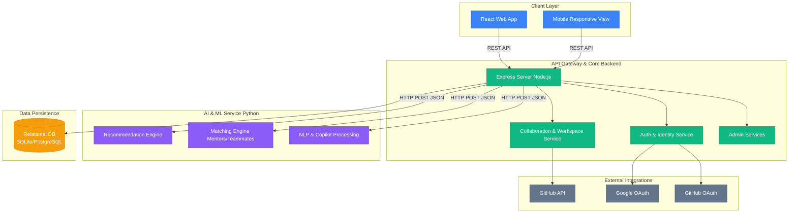
<div class="diagram-caption">Figure 1: High-level System Architecture</div>
</div>

<h3>2. Client-Server Communication Architecture</h3>
<p>The communication between the client and server strictly follows RESTful principles over HTTP. Stateful communication (such as tracking real-time collaboration) relies on persistent polling or Server-Sent Events (SSE) depending on configuration, backed by stateless JWT authentication for every request.</p>

<div class="diagram-container">
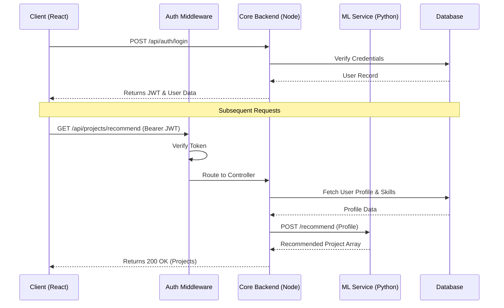
<div class="diagram-caption">Figure 2: Request/Response Flow Diagram</div>
</div>

<h3>3. Component Architecture</h3>
<p>ScholarConnect follows a strict modular structure. Components are decoupled by domain.</p>

<div class="diagram-container">
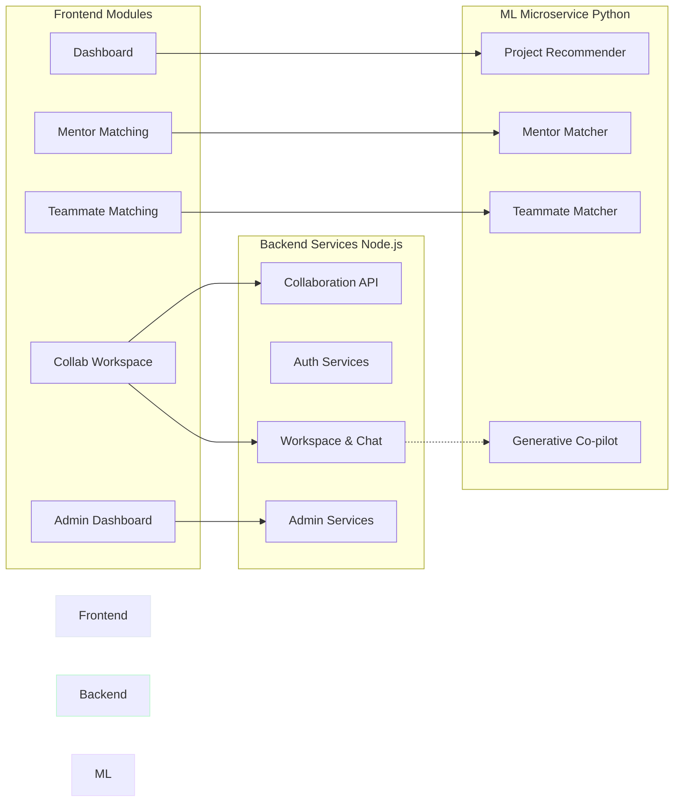
<div class="diagram-caption">Figure 3: Internal Component Service Boundaries</div>
</div>

</div>


<div class="page">

<div class="section-label">Section B</div>
<h2>Data Flow Diagrams (DFD)</h2>

<h3>4. DFD Level 0 (Context Diagram)</h3>
<p>The Level 0 Context Diagram establishes the boundaries of the ScholarConnect system, showing external entities and the major data flows into and out of the system.</p>

<div class="diagram-container">
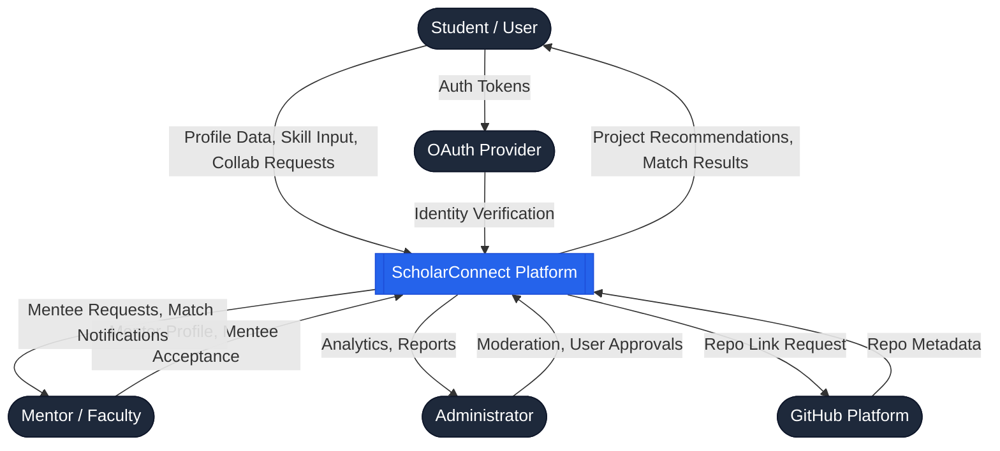
<div class="diagram-caption">Figure 4: Level 0 Context DFD</div>
</div>

<h3>5. DFD Level 1</h3>
<p>The Level 1 diagram breaks the main system down into major functional subsystems: Identity, Recommendation, Collaboration, and Mentorship.</p>

<div class="diagram-container">
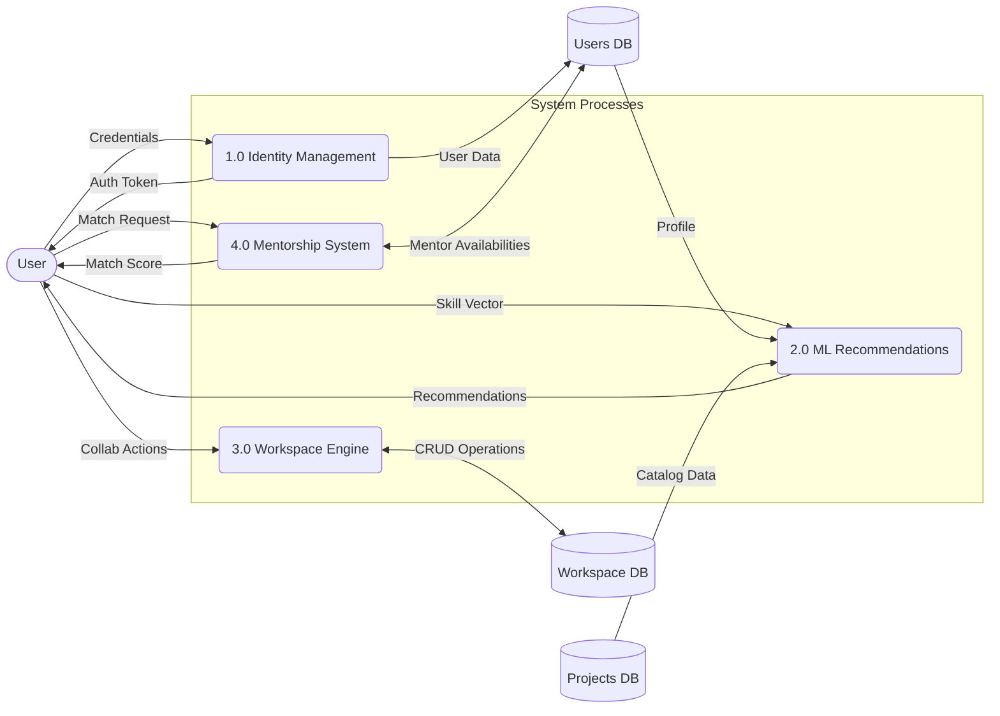
<div class="diagram-caption">Figure 5: Level 1 Functional DFD</div>
</div>

<h3>6. DFD Level 2 (Critical Subsystems)</h3>

<h4>6.1 Workspace & Collaboration Workflow (Level 2)</h4>
<div class="diagram-container">
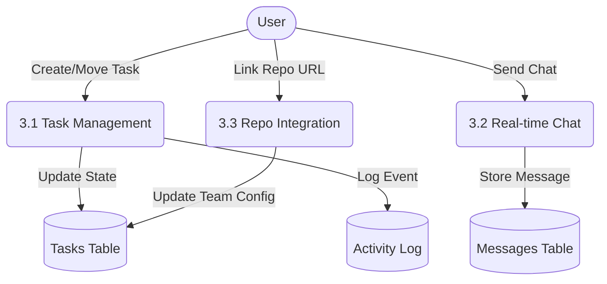
<div class="diagram-caption">Figure 6.1: Level 2 DFD - Workspace Engine</div>
</div>

<h4>6.2 Invite & Collaboration Request System (Level 2)</h4>
<div class="diagram-container">
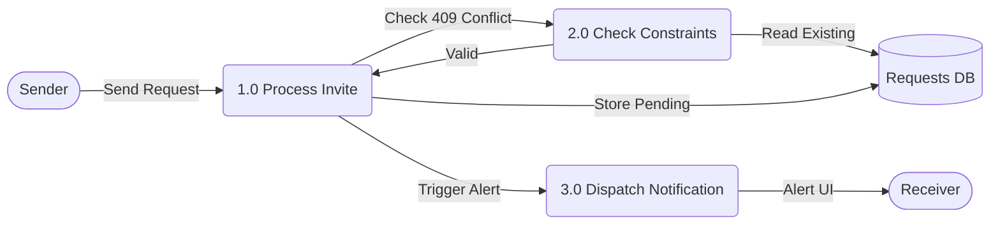
<div class="diagram-caption">Figure 6.2: Level 2 DFD - Smart Invites with 409 Constraint Guard</div>
</div>

</div>


<div class="page">

<div class="section-label">Section C</div>
<h2>Database / Data Model</h2>

<h3>7. ER Diagram (Logical Data Model)</h3>
<p>ScholarConnect's database architecture is highly relational, utilizing strict foreign key constraints and optimized indexing strategies. The primary entities span across Users, Projects, Skills, Recommendations, and Collaborative Workspaces.</p>

<div class="diagram-container" style="max-height: 800px; overflow-y: auto;">
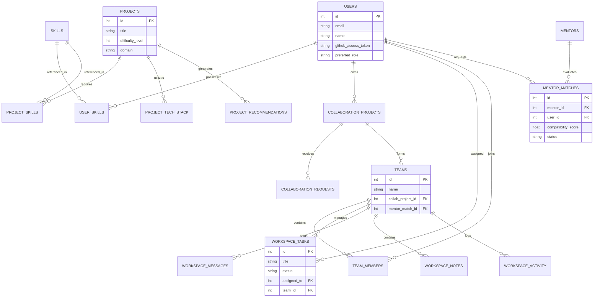
<div class="diagram-caption">Figure 7: Logical Entity-Relationship (ER) Diagram</div>
</div>

<h3>8. Schema / Collections Model</h3>
<p>The SQLite/MySQL schema uses normalized tables to prevent data anomalies. Key collections and their properties include:</p>

<table>
  <thead>
    <tr>
      <th>Table / Entity</th>
      <th>Primary Purpose</th>
      <th>Key Constraints & Relations</th>
    </tr>
  </thead>
  <tbody>
    <tr>
      <td><code>users</code></td>
      <td>Core identity, OAuth tokens, role preferences.</td>
      <td><code>email</code> is UNIQUE.</td>
    </tr>
    <tr>
      <td><code>projects</code></td>
      <td>Catalog of base projects from which recommendations are built.</td>
      <td>Links to <code>project_skills</code> (M:N).</td>
    </tr>
    <tr>
      <td><code>collaboration_projects</code></td>
      <td>User-instantiated projects that are open for teaming.</td>
      <td>1:1 with <code>teams</code>, stores <code>github_repo_url</code>.</td>
    </tr>
    <tr>
      <td><code>collaboration_requests</code></td>
      <td>Tracks invites and join requests (prevents duplication).</td>
      <td>UNIQUE constraints across sender and receiver states.</td>
    </tr>
    <tr>
      <td><code>mentor_matches</code></td>
      <td>Tracks the lifecycle of a mentorship request.</td>
      <td>UNIQUE(user_id, mentor_id) prevents duplicate requests.</td>
    </tr>
    <tr>
      <td><code>workspace_tasks</code></td>
      <td>Kanban board persistence.</td>
      <td>Tied strictly to <code>team_id</code>.</td>
    </tr>
  </tbody>
</table>

<h3>9. Schema Design Document</h3>
<p>Our schema design adheres to the following principles:</p>
<ul>
  <li><strong>Normalization:</strong> M:N relationships (like Users and Skills) are strictly broken down using associative tables (<code>user_skills</code>, <code>project_skills</code>).</li>
  <li><strong>Soft Constraints:</strong> Deletions in teams cascade carefully; activity logs maintain historical references.</li>
  <li><strong>Duplicate Prevention:</strong> The <code>collaboration_requests</code> and <code>mentor_matches</code> tables utilize composite UNIQUE constraints handled natively by the database engine to guarantee integrity against concurrent race conditions (throwing <code>409 Conflict</code>).</li>
</ul>

</div>


<div class="page">

<div class="section-label">Section D</div>
<h2>Algorithm / Workflow Diagrams</h2>

<h3>10. Project Recommendation Workflow</h3>
<p>The ML Service handles real-time project recommendation. It processes user skills, academic level, and interests against 20+ diverse domain blueprints to synthesize highly personalized projects.</p>

<div class="diagram-container">
```mermaid
flowchart TD
    Start([Client Request]) --> API[Node.js API Gateway]
    API --> ML[ML Service POST /generate]
    ML --> Filter{Filter Blueprints by Domain}
    
    Filter -->|Match| BP_Match[Select Domain Blueprints]
    Filter -->|No Match| BP_Random[Select Random Diverse Blueprints]
    
    BP_Match --> Synth[Synthesis Engine]
    BP_Random --> Synth
    
    Synth --> Math[Calculate Base Score\nS = (W1 * Skill) + (W2 * Diff) + (W3 * Domain)]
    Math --> Randomize[Inject ±15% Random Variance for Diversity]
    Randomize --> Sort[Sort by Final Score Descending]
    
    Sort --> Format[Format JSON Response]
    Format --> API
    API --> UI([Display to User])
```
<div class="diagram-caption">Figure 8: Project Generation & Recommendation Logic</div>
</div>

<h3>11. Mentor Matching Workflow</h3>
<p>Matching users to mentors relies on a strictly weighted compatibility formula.</p>
<div class="formula">
Match Score = (0.40 × Skill Match) + (0.30 × Domain Match) + (0.20 × Exp Match) + (0.10 × Availability)
</div>

<div class="diagram-container">
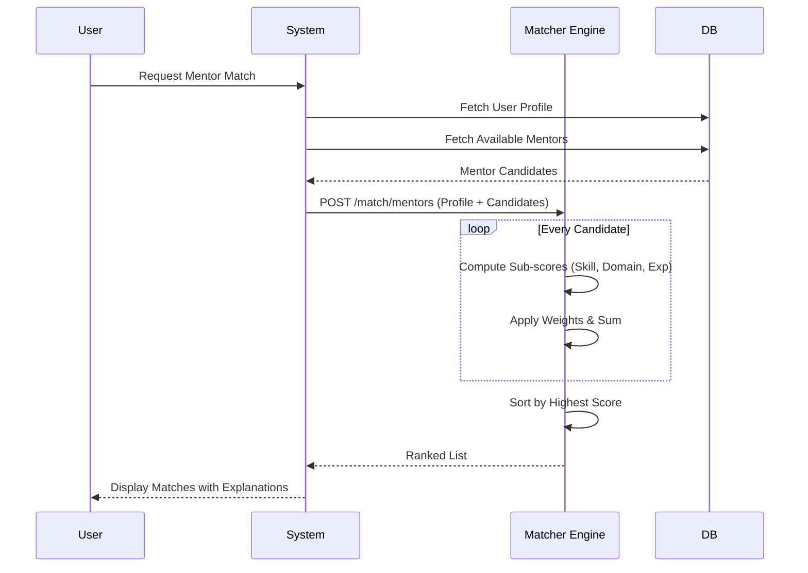
<div class="diagram-caption">Figure 9: Mentor Ranking & Matching Sequence</div>
</div>

<h3>12. Smart Invite / Collaboration Workflow</h3>
<p>This flow guarantees duplicate prevention via defensive database constraints.</p>

<div class="diagram-container">
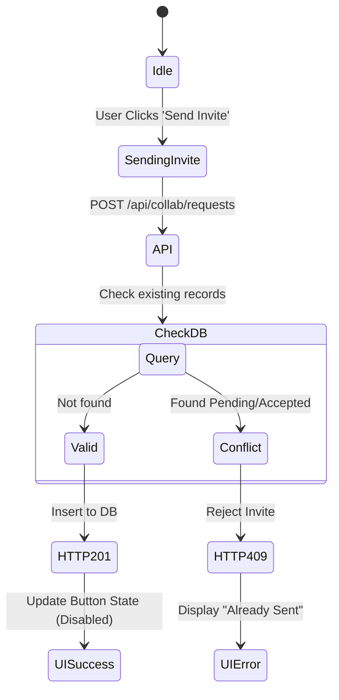
<div class="diagram-caption">Figure 10: State Machine for Duplicate Invite Prevention</div>
</div>

<h3>13. GitHub Import Pipeline Workflow</h3>
<div class="diagram-container">
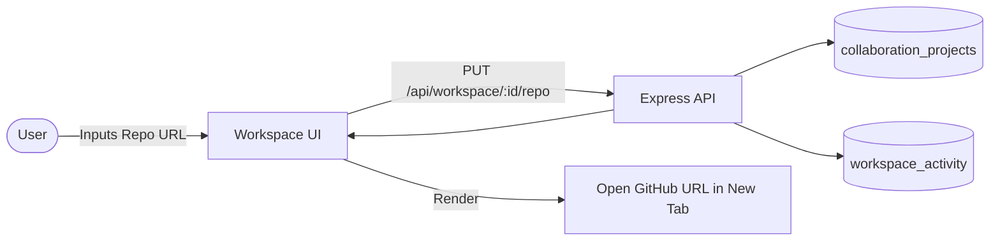
<div class="diagram-caption">Figure 11: GitHub Repo Linking Pipeline</div>
</div>

</div>


<div class="page">

<div class="section-label">Section E</div>
<h2>User Flows</h2>

<h3>14. End-to-End User Journey</h3>
<p>The standard user journey for a student moving from onboarding to active collaboration.</p>

<div class="diagram-container">
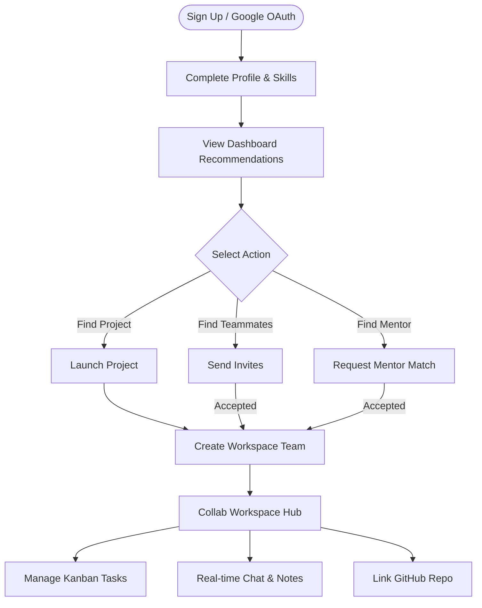
<div class="diagram-caption">Figure 12: End-to-end User Journey</div>
</div>

<h3>15. Persona-Specific Flows</h3>

<h4>Admin Flow</h4>
<div class="diagram-container">
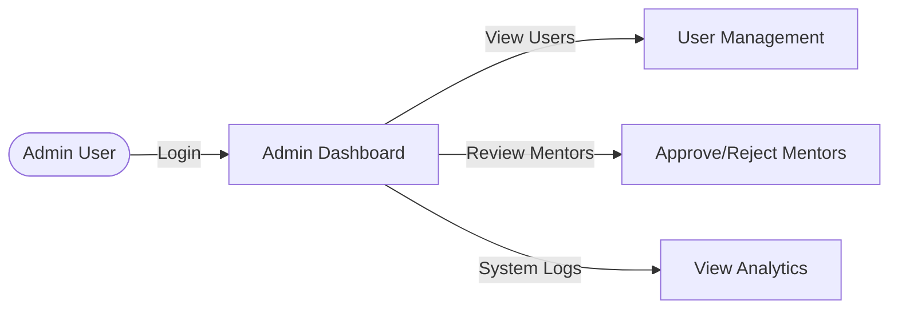
<div class="diagram-caption">Figure 13: Administrator Flow</div>
</div>

<div class="section-label" style="margin-top: 40px;">Section F</div>
<h2>Advanced Engineering Diagrams</h2>

<h3>16. Collaboration Workspace State Machine</h3>
<p>The lifecycle of a workspace task through the Kanban system.</p>

<div class="diagram-container">
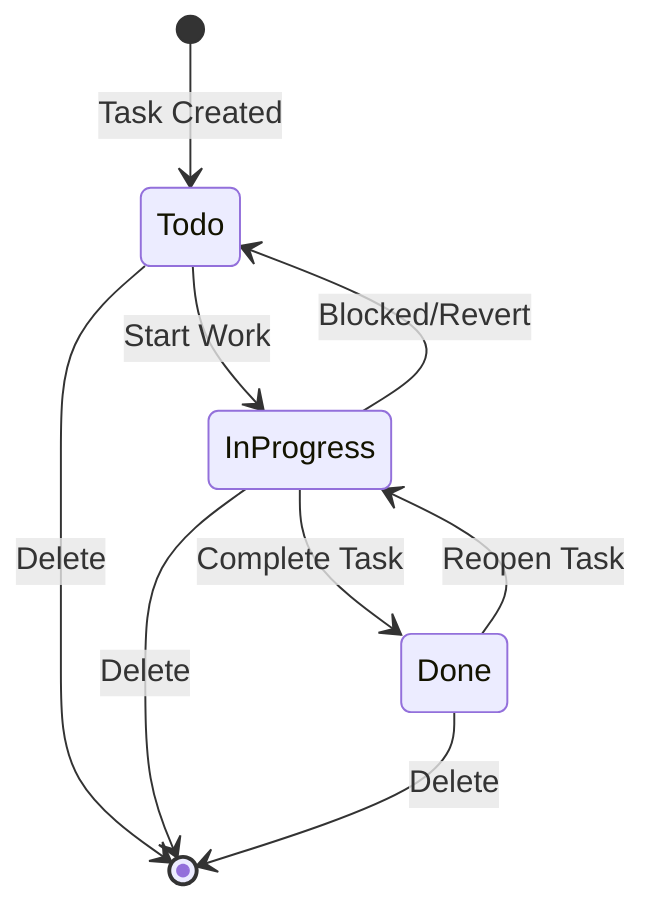
<div class="diagram-caption">Figure 14: Kanban Task State Machine</div>
</div>

<h3>17. Class Diagram: Core Services</h3>
<div class="diagram-container">
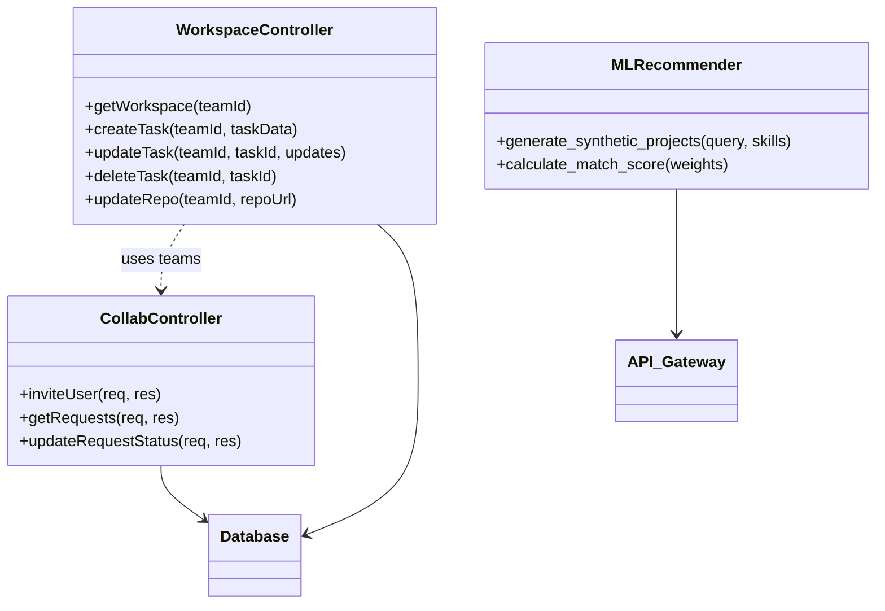
<div class="diagram-caption">Figure 15: Core Controller Class Diagram</div>
</div>

</div>


<div class="page">

<div class="section-label">Section G</div>
<h2>Security & Scalability</h2>

<h3>18. Security Architecture</h3>
<p>Security is enforced at multiple layers of the application.</p>

<div class="diagram-container">
```mermaid
graph TD
    subgraph Client Layer
        Sanitize[XSS Prevention - React]
        NoStore[No Sensitive Data in LocalStorage]
    end

    subgraph Transport Layer
        TLS[TLS/SSL Encryption]
        CORS[Strict CORS Policy]
    end

    subgraph API Gateway
        RateLimiter[express-rate-limit]
        Helmet[Helmet HTTP Headers]
        JWT[JWT Bearer Verification]
    end

    subgraph Data Layer
        BCrypt[Bcrypt Password Hashing]
        Params[Parameterized Queries / SQLi Prevention]
    end

    Client Layer --> Transport Layer --> API Gateway --> Data Layer
```
<div class="diagram-caption">Figure 16: Security Architecture</div>
</div>

<ul>
  <li><strong>Authentication Flow:</strong> JWTs are issued via AuthController and validated using the <code>authenticate</code> middleware on all protected routes.</li>
  <li><strong>Data Integrity:</strong> Defensive constraints in <code>schema.sql</code> prevent bad state (e.g., duplicated invites, orphaned tasks).</li>
</ul>

<h3>19. Scalability Architecture</h3>
<p>The system is designed to scale horizontally by decoupling the CPU-intensive Machine Learning operations from the I/O-intensive Express server.</p>

<div class="diagram-container">
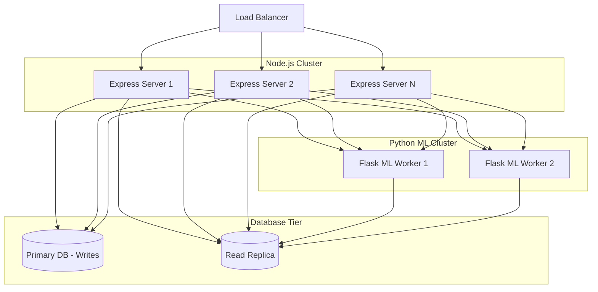
<div class="diagram-caption">Figure 17: Future Scaling & Microservices Decomposition Diagram</div>
</div>

<h3>20. Deployment Architecture</h3>
<p>The development environment uses Docker Compose to orchestrate the Client, Server, and ML Service. Production deployments target managed container services (e.g., AWS ECS, Google Cloud Run) utilizing the same containerized footprints.</p>

</div>

<!-- End of Document -->


