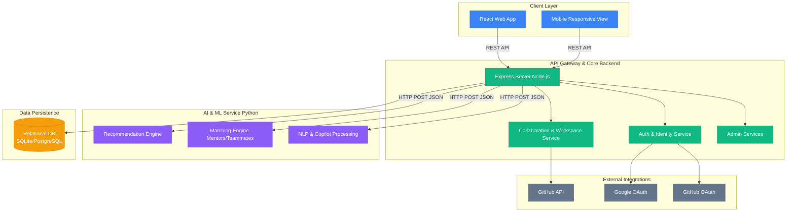
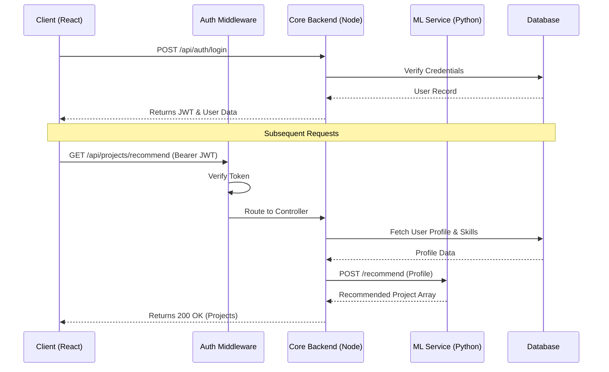
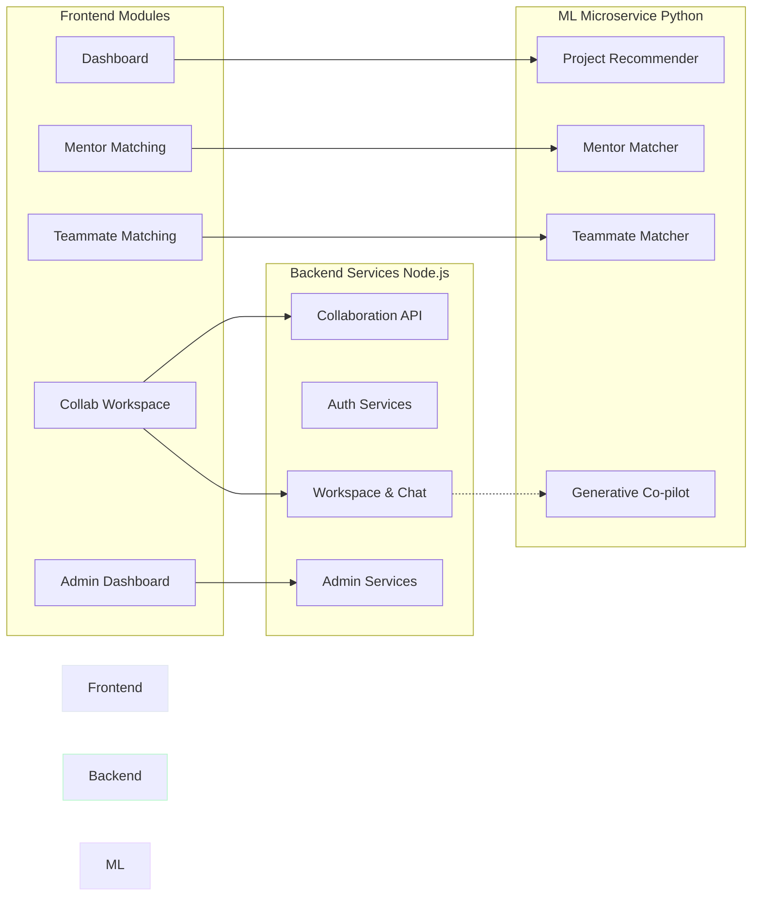

# ScholarConnect — System Architecture Documentation

  <h1>ScholarConnect</h1>
  
Complete Architecture & Engineering Design Package

  
Generated: April 2026

  <h2>Table of Contents</h2>
  

    
Section A — System Architecture

    
1. High-level system architecture

    
2. Client-server communication

    
3. Component architecture

    
Section B — Data Flow Diagrams

    
4. DFD Level 0 (Context)

    
5. DFD Level 1

    
6. DFD Level 2 (Critical Subsystems)

    
Section C — Database / Data Model

    
7. ER Diagram (Logical)

    
8. Database Schema / Collections

    
9. Schema Design Document

    
Section D — Algorithm & Workflows

    
10. Skill Selection Flow

    
11. Project Recommendation Flow

    
12. Mentor Matching Flow

    
13. Smart Invite / Collab Matching

    
14. AI Copilot / Generative Flow

    
15. GitHub Import Pipeline

    
16. Collaboration Lifecycle

    
Section E — User Flows

    
17. End-to-end User Journey

    
18. Persona Flows (Mentee, Mentor, Admin)

    
19. State Transitions

    
Section F — Advanced Engineering Diagrams

    
20. Advanced Diagrams

    
Section G — Security & Scalability

    
21. Security Architecture

    
22. Scalability Architecture

  

Section A

<h2>System Architecture</h2>

<h3>1. High-Level System Architecture</h3>

ScholarConnect is a distributed, service-oriented architecture comprised of a React frontend, Node.js/Express core backend, and a specialized Python machine-learning service. The entire platform is backed by a relational database (SQLite in development, configurable for PostgreSQL/MySQL in production).

Figure 1: High-level System Architecture

<h3>2. Client-Server Communication Architecture</h3>

The communication between the client and server strictly follows RESTful principles over HTTP. Stateful communication (such as tracking real-time collaboration) relies on persistent polling or Server-Sent Events (SSE) depending on configuration, backed by stateless JWT authentication for every request.

Figure 2: Request/Response Flow Diagram

<h3>3. Component Architecture</h3>

ScholarConnect follows a strict modular structure. Components are decoupled by domain.

Figure 3: Internal Component Service Boundaries

