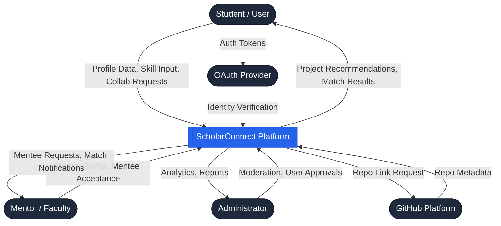
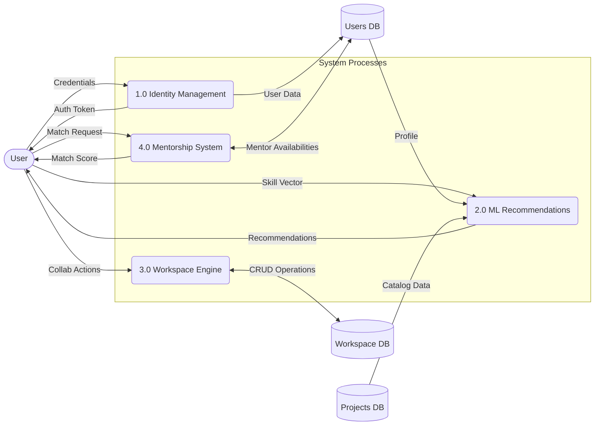
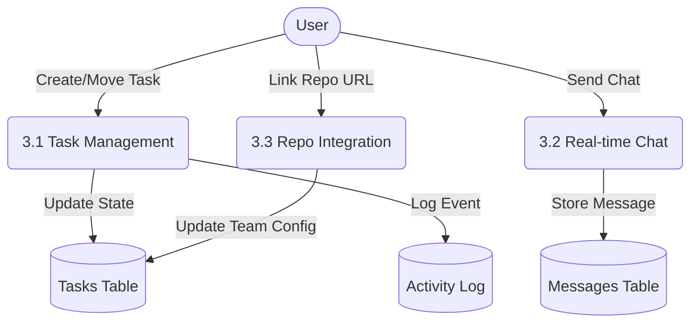
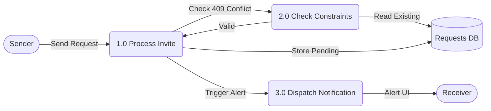

Section B

<h2>Data Flow Diagrams (DFD)</h2>

<h3>4. DFD Level 0 (Context Diagram)</h3>

The Level 0 Context Diagram establishes the boundaries of the ScholarConnect system, showing external entities and the major data flows into and out of the system.

Figure 4: Level 0 Context DFD

<h3>5. DFD Level 1</h3>

The Level 1 diagram breaks the main system down into major functional subsystems: Identity, Recommendation, Collaboration, and Mentorship.

Figure 5: Level 1 Functional DFD

<h3>6. DFD Level 2 (Critical Subsystems)</h3>

<h4>6.1 Workspace & Collaboration Workflow (Level 2)</h4>

Figure 6.1: Level 2 DFD - Workspace Engine

<h4>6.2 Invite & Collaboration Request System (Level 2)</h4>

Figure 6.2: Level 2 DFD - Smart Invites with 409 Constraint Guard

