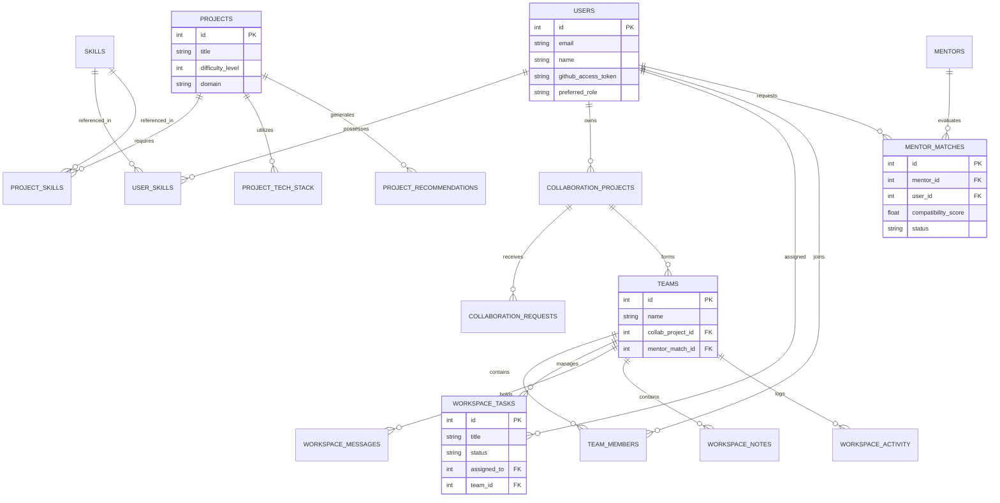

Section C

<h2>Database / Data Model</h2>

<h3>7. ER Diagram (Logical Data Model)</h3>

ScholarConnect's database architecture is highly relational, utilizing strict foreign key constraints and optimized indexing strategies. The primary entities span across Users, Projects, Skills, Recommendations, and Collaborative Workspaces.

Figure 7: Logical Entity-Relationship (ER) Diagram

<h3>8. Schema / Collections Model</h3>

The SQLite/MySQL schema uses normalized tables to prevent data anomalies. Key collections and their properties include:

<table>
  <thead>
    <tr>
      <th>Table / Entity</th>
      <th>Primary Purpose</th>
      <th>Key Constraints & Relations</th>
    </tr>
  </thead>
  <tbody>
    <tr>
      <td><code>users</code></td>
      <td>Core identity, OAuth tokens, role preferences.</td>
      <td><code>email</code> is UNIQUE.</td>
    </tr>
    <tr>
      <td><code>projects</code></td>
      <td>Catalog of base projects from which recommendations are built.</td>
      <td>Links to <code>project_skills</code> (M:N).</td>
    </tr>
    <tr>
      <td><code>collaboration_projects</code></td>
      <td>User-instantiated projects that are open for teaming.</td>
      <td>1:1 with <code>teams</code>, stores <code>github_repo_url</code>.</td>
    </tr>
    <tr>
      <td><code>collaboration_requests</code></td>
      <td>Tracks invites and join requests (prevents duplication).</td>
      <td>UNIQUE constraints across sender and receiver states.</td>
    </tr>
    <tr>
      <td><code>mentor_matches</code></td>
      <td>Tracks the lifecycle of a mentorship request.</td>
      <td>UNIQUE(user_id, mentor_id) prevents duplicate requests.</td>
    </tr>
    <tr>
      <td><code>workspace_tasks</code></td>
      <td>Kanban board persistence.</td>
      <td>Tied strictly to <code>team_id</code>.</td>
    </tr>
  </tbody>
</table>

<h3>9. Schema Design Document</h3>

Our schema design adheres to the following principles:

<ul>
  <li><strong>Normalization:</strong> M:N relationships (like Users and Skills) are strictly broken down using associative tables (<code>user_skills</code>, <code>project_skills</code>).</li>
  <li><strong>Soft Constraints:</strong> Deletions in teams cascade carefully; activity logs maintain historical references.</li>
  <li><strong>Duplicate Prevention:</strong> The <code>collaboration_requests</code> and <code>mentor_matches</code> tables utilize composite UNIQUE constraints handled natively by the database engine to guarantee integrity against concurrent race conditions (throwing <code>409 Conflict</code>).</li>
</ul>

