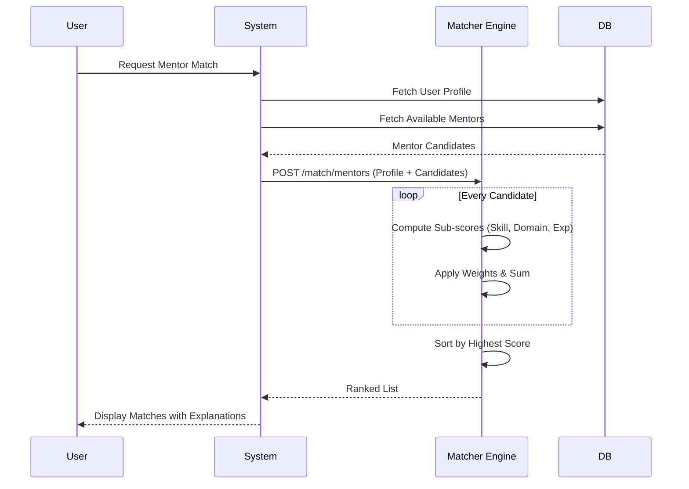
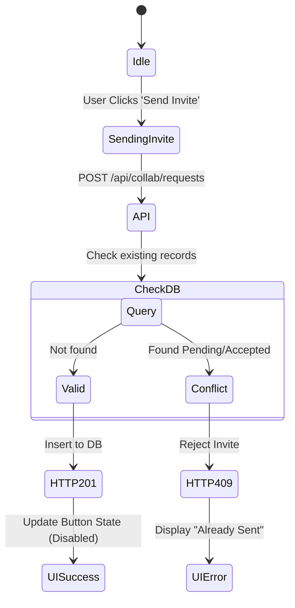
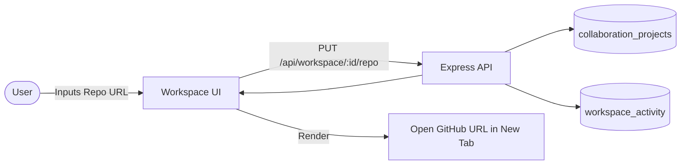

<div class="page">

<div class="section-label">Section D</div>
<h2>Algorithm / Workflow Diagrams</h2>

<h3>10. Project Recommendation Workflow</h3>
<p>The ML Service handles real-time project recommendation. It processes user skills, academic level, and interests against 20+ diverse domain blueprints to synthesize highly personalized projects.</p>

<div class="diagram-container">
```mermaid
flowchart TD
    Start([Client Request]) --> API[Node.js API Gateway]
    API --> ML[ML Service POST /generate]
    ML --> Filter{Filter Blueprints by Domain}
    
    Filter -->|Match| BP_Match[Select Domain Blueprints]
    Filter -->|No Match| BP_Random[Select Random Diverse Blueprints]
    
    BP_Match --> Synth[Synthesis Engine]
    BP_Random --> Synth
    
    Synth --> Math[Calculate Base Score\nS = (W1 * Skill) + (W2 * Diff) + (W3 * Domain)]
    Math --> Randomize[Inject ±15% Random Variance for Diversity]
    Randomize --> Sort[Sort by Final Score Descending]
    
    Sort --> Format[Format JSON Response]
    Format --> API
    API --> UI([Display to User])
```
<div class="diagram-caption">Figure 8: Project Generation & Recommendation Logic</div>
</div>

<h3>11. Mentor Matching Workflow</h3>
<p>Matching users to mentors relies on a strictly weighted compatibility formula.</p>
<div class="formula">
Match Score = (0.40 × Skill Match) + (0.30 × Domain Match) + (0.20 × Exp Match) + (0.10 × Availability)
</div>

<div class="diagram-container">

<div class="diagram-caption">Figure 9: Mentor Ranking & Matching Sequence</div>
</div>

<h3>12. Smart Invite / Collaboration Workflow</h3>
<p>This flow guarantees duplicate prevention via defensive database constraints.</p>

<div class="diagram-container">

<div class="diagram-caption">Figure 10: State Machine for Duplicate Invite Prevention</div>
</div>

<h3>13. GitHub Import Pipeline Workflow</h3>
<div class="diagram-container">

<div class="diagram-caption">Figure 11: GitHub Repo Linking Pipeline</div>
</div>

</div>
