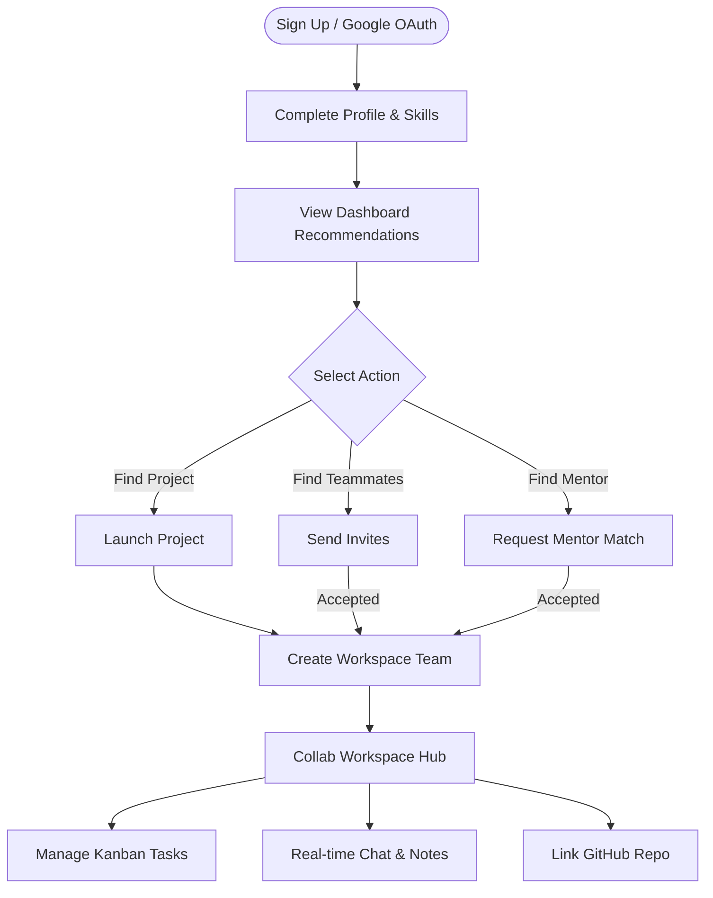
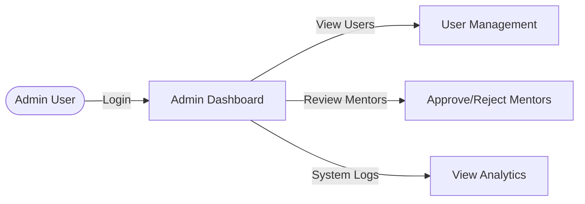
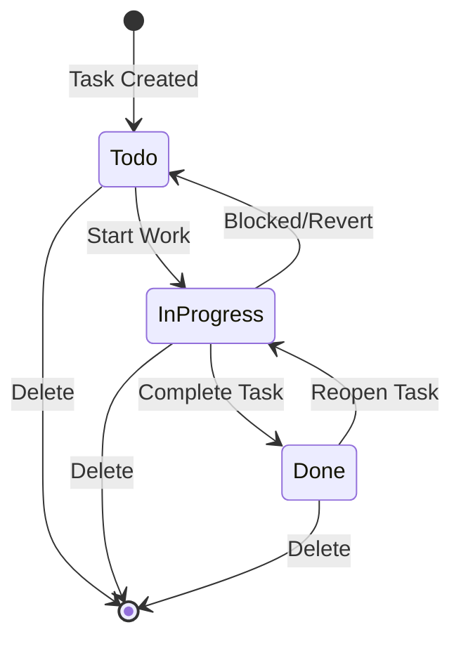
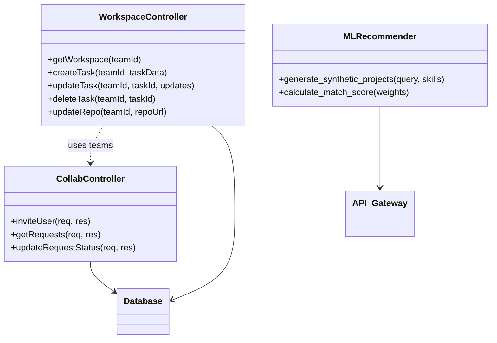

Section E

<h2>User Flows</h2>

<h3>14. End-to-End User Journey</h3>

The standard user journey for a student moving from onboarding to active collaboration.

Figure 12: End-to-end User Journey

<h3>15. Persona-Specific Flows</h3>

<h4>Admin Flow</h4>

Figure 13: Administrator Flow

Section F

<h2>Advanced Engineering Diagrams</h2>

<h3>16. Collaboration Workspace State Machine</h3>

The lifecycle of a workspace task through the Kanban system.

Figure 14: Kanban Task State Machine

<h3>17. Class Diagram: Core Services</h3>

Figure 15: Core Controller Class Diagram

