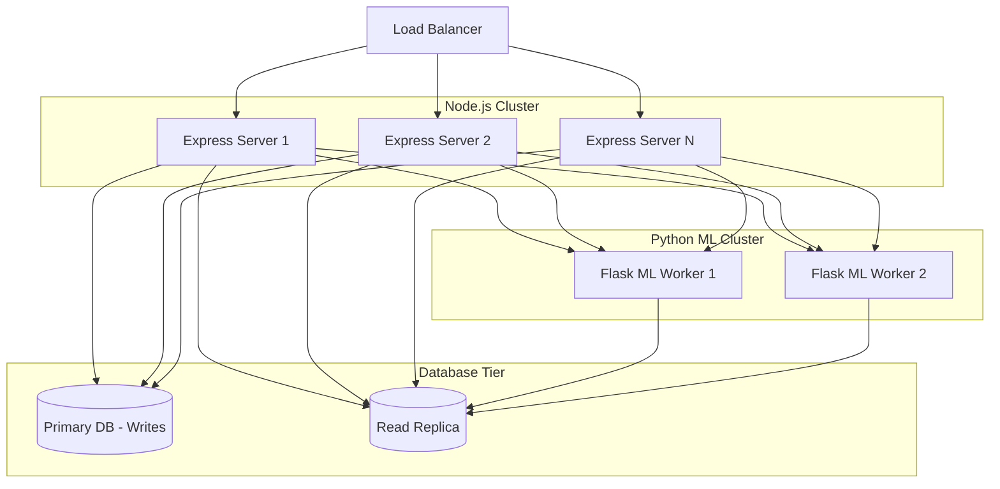

<div class="page">

<div class="section-label">Section G</div>
<h2>Security & Scalability</h2>

<h3>18. Security Architecture</h3>
<p>Security is enforced at multiple layers of the application.</p>

<div class="diagram-container">
```mermaid
graph TD
    subgraph Client Layer
        Sanitize[XSS Prevention - React]
        NoStore[No Sensitive Data in LocalStorage]
    end

    subgraph Transport Layer
        TLS[TLS/SSL Encryption]
        CORS[Strict CORS Policy]
    end

    subgraph API Gateway
        RateLimiter[express-rate-limit]
        Helmet[Helmet HTTP Headers]
        JWT[JWT Bearer Verification]
    end

    subgraph Data Layer
        BCrypt[Bcrypt Password Hashing]
        Params[Parameterized Queries / SQLi Prevention]
    end

    Client Layer --> Transport Layer --> API Gateway --> Data Layer
```
<div class="diagram-caption">Figure 16: Security Architecture</div>
</div>

<ul>
  <li><strong>Authentication Flow:</strong> JWTs are issued via AuthController and validated using the <code>authenticate</code> middleware on all protected routes.</li>
  <li><strong>Data Integrity:</strong> Defensive constraints in <code>schema.sql</code> prevent bad state (e.g., duplicated invites, orphaned tasks).</li>
</ul>

<h3>19. Scalability Architecture</h3>
<p>The system is designed to scale horizontally by decoupling the CPU-intensive Machine Learning operations from the I/O-intensive Express server.</p>

<div class="diagram-container">

<div class="diagram-caption">Figure 17: Future Scaling & Microservices Decomposition Diagram</div>
</div>

<h3>20. Deployment Architecture</h3>
<p>The development environment uses Docker Compose to orchestrate the Client, Server, and ML Service. Production deployments target managed container services (e.g., AWS ECS, Google Cloud Run) utilizing the same containerized footprints.</p>

</div>

<!-- End of Document -->
